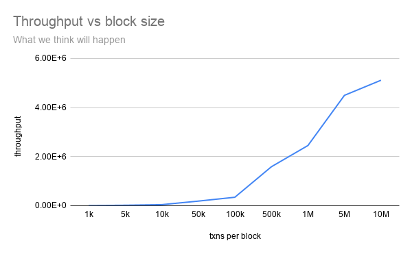
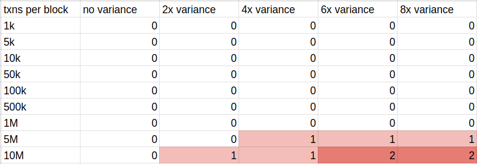
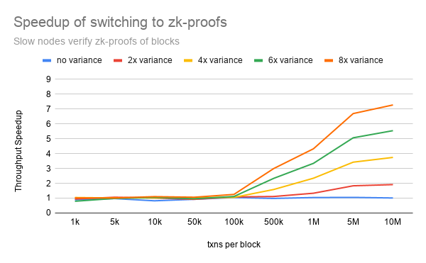

# ZK-Augmented HotStuff: Decoupling Block Validation from Consensus Throughput in Permissionless BFT

Joss Duff

A BFT replicated state machine where the proposer proves state transition execution with a SP1 zero-knowledge proof, and validators verify the proof instead of re-executing the block themselves.

## Problem

Our blockchain is too slow. We have more transactions than we can fit in each block and users are getting frustrated that they have to wait multiple blocks before their transaction is included.

This is a great problem to have! All we have to do is to increase the size of the blocks and we'll have a much higher throughput!

We run some simulations and hypothesize how much throughput we can get:

This looks great! Let's implement it live in production and see how our network performs with larger block sizes:

.png)

Woah! This isn't right.

## What went wrong?

The simulation neglected to capture the heterogeneity of the network! A key property of blockchains is that they are **permissionless**: anyone can join. Some nodes will be running on an AWS US-east-large instance, and others will be running on their 2014 Macbook. Even though they differ in computation, these nodes contribute equally to the safety and liveness guarantees of our blockchain of N >= 3f + 1.

In the above example [data I collected, not just my imagination. See Experiment Setup section], the network waits for n-f responses during a round of consensus. In this network setup, there are f+1 slow nodes who take 4x longer to validate the proposed STF (block). It must validate the block is correct before voting for it. With only f slow nodes, the n-f fast responses could complete without them; f+1 forces at least one slow node into every quorum.

The entire network is bottlenecked by the speed of a single slow machine. Even if all the other machines are supercomputers!

The network could, of course, ignore the honest-but-slow nodes and decide to progress anyways, but that would lower the network's security.

## Solution

To completely remove the slow node bottleneck, we allow nodes to optionally verify a zk-proof instead of re-executing the entire block to check for STF validity.

The leader in a round of consensus must broadcast both:
1. Their proposed ordering
2. (new) A zero knowledge proof that verifies the STF is correct

To validate the STF, replicas can choose to verify the zk-proof of the block instead of re-executing the entire block. The verification of a zk-proof is constant time and MUCH faster than re-executing large blocks.

You might ask "why must the replicas validate the STF at all? Consensus only cares about ordering, not correctness of the STF".

Classically, this is true. In a permissioned setting where leaders are trusted to propose well-formed blocks, replicas can commit whatever ordering consensus produces and apply the resulting state transitions blindly. In the blockchain setting this breaks down. A malicious leader can propose a block whose transactions are individually well-formed and correctly signed, but whose application produces an invalid state: double-spends, balances going negative, transfers from accounts the sender doesn't control. Without STF validation at the replica level, the network would commit this invalid state, and there would be no mechanism to reject it after the fact. Replicas must therefore convince themselves the proposed post-state is correct before voting, whether by re-executing the block themselves or by verifying a zk-proof of its execution.

## Implementation details

### State Transition Function

I implemented a simple ledger for my state machine. There are 10,000 accounts, represented as a u32, and each account has a "balance", represented as a u64. Each account's initial balance is 10,000.

A "block" is a group of transactions applied to a state. Each transaction is a transfer of an amount from one account to another, all randomly generated.

During execution of each block, the state root is computed as a Merkle tree where the leaves are SHA256(account_id || balance).

### Zero Knowledge Proofs

I'm generating compressed STARK proofs of our STF using Succinct's zkVM. Succinct is a toolchain (also known as a zkVM) that allows developers to turn Rust code into Zero Knowledge circuits, which then can be used to generate proofs of correct execution of that Rust code. There are many flavors of zk-proofs, each with their own tradeoffs. I went with Succinct's compressed STARKS because they have constant proof size (constant verification cost) and are relatively quicker to generate than Succinct's other proof options. It's worth further experimenting with other zkVMs and zk-proof types, depending on your STF.

### Consensus

My proposed solution is agnostic towards consensus algorithm choice. The only requirements are SMR, leader-based, and BFT (since the problem is relevant to the permissionless setting). This solution could be visualized in a simple distributed quorum, but that wouldn't capture the overhead imposed by consensus.

I chose HotStuff consensus as the base of this implementation because it is well studied, relatively simple, and fulfils our requirements.

#### HotStuff overview

HotStuff's main contributions are **linear view-change** and **optimistic responsiveness**.

- **Linear view-change**: when a leader fails, the next leader needs only O(n) authenticators to drive consensus forward (vs. O(n²) or O(n³) in PBFT-style protocols).
- **Optimistic responsiveness**: An honest leader, once designated, can drive consensus at network speed without waiting Δ

The trick: if any correct replica is locked on a prepareQC (quorum certificate), then at least n - f replicas have that prepareQC stored locally. By quorum intersection, the next leader's NEW-VIEW collection of n-f responses is guaranteed to include at least one copy of that prepareQC.

HotStuff has 4 phases of messages per-view:

1. **PREPARE**: leader proposes a new block, replicas check it's safe and vote
2. **PRE-COMMIT**: leader aggregates n-f PREPARE votes into a prepareQC and broadcasts, replicas update their local prepareQC and vote.
   - Replica POV: "Now I've stored this QC"
3. **COMMIT**: leader aggregates n-f PRE-COMMIT votes into a precommitQC and broadcasts, replicas now lock on this QC and vote.
   - Replica POV: "Now I know n-f other replicas have stored this QC. I can lock on this QC."
4. **DECIDE**: leader aggregates n-f COMMIT votes into a commitQC and broadcasts, replicas execute the committed block.

Without the PRE-COMMIT phase, the network would either have to accept Δ delays at every view change or use quadratic communication for view-changes.

#### HotStuff details relevant to this project

Leader-selection is round robin and the block is validated by the replica during the PREPARE phase (either by re-execution or verifying a zk proof).

## Experiment Setup

Each experiment is 5 rounds of HotStuff consensus over 5 proposed blocks [It costs me money to generate the zk-proofs for each block, so 5 will have to be enough of a sample size for now]. We have 9 different workloads (block sizes) to represent scaling the size of the STF: blocks of 1k, 5k, 10k, 50k, 100k, 500k, 1M, 5M, and 10M transactions.

All experiments are run on Sunlab. To show the bottleneck of slow nodes in the path of consensus, we need to have f + 1 slow nodes. For our small setup, we have 4 nodes, 2 of them being slow.

A "slow node" means it sleeps for some nanoseconds after re-executing each transaction. Ideally I would like to have tested this on a network where the nodes genuinely differ in computing power, but Sunlab is all I had access to so the "slowness" had to be simulated. A node could be slower because of a slower CPU, less memory, less cores, etc.

I pre-generated all the transactions and proofs for each workload and copied them to the sunlab machines before running each experiment. To reference a group of transactions, the leader sends the number corresponding to the workload to the replica, and the replica looks locally for that batch of transactions. This abstracts out the networking layer that would otherwise might obscure my findings.

Node **variance** is the speed difference between the fast and slow nodes in that network. "2x variance" means the slow nodes are 2 times slower than the fast nodes. "8x variance" means the slow nodes are 8 times slower than the fast nodes. Etc.

As soon as n-f nodes respond, there is no additional waiting and consensus proceeds to the next round. HotStuff refers to this as consensus at the pace of actual (vs. maximum) network delay.

If the network fails to reach consensus within the timeout window of 2.5 seconds, it re-tries from the same block with a new leader and a doubled timeout window. This occurs when the slow nodes cannot re-execute the entire block within the timeout window. The initial window of 2.5 seconds was chosen because it takes just over 2 seconds for a fast node to execute our largest workload (a 10M txn block).

## Data

We measure network throughput as transactions per second. Throughput should increase as txns per block increases, assuming that each block takes at most 2.5 seconds. When it takes f+1 nodes MORE THAN 2.5 seconds to validate a block, throughput starts to diminish as blocks get re-tried.

.png)

In a regular network with block re-execution (no zk-proof verification), we see great throughput scaling when there is no node variance and diminishing returns as variance is increased. At 4, 6, and 8x node variance, there is almost no throughput increase from scaling the block size from 500k to 10M transactions.

### Consensus Failures per block (re-execution)

Part of the decrease in throughput is explained by the amount of consensus rounds required to commit each block.

- 0 failures = block was committed in the first try (2.5 second timeout)
- 1 failure = block was committed in the second try (5 second timeout)
- 2 failures = block was committed in the third try (10 second timeout)

Slow nodes bottlenecked the network by not responding within the timeout window, forcing multiple rounds of consensus per block.

.png)

When slow nodes verify a zk proof instead of re-executing the entire block, the bottleneck of slow nodes is completely eliminated, and the network proceeds at the pace of the fast nodes. In this setup, there are no timeouts hit during consensus, compared to the above table.

In smaller block sizes where the slow nodes do not bottleneck the system there is no meaningful speedup. There is only significant speedup at blocks of 500k and up. In fact, there is actually a small *slowdown* in smaller blocks where slow nodes can execute the block in less time than the constant time of verifying a zk-proof.

## Considerations

### ZK-proof generation

Zk proofs are computationally very expensive to generate. It is likely that a leader doesn't have the computing power to generate a proof of their block locally within its block-selection time. However, since it's trivial to verify the correctness of a zk-proof, the leader can outsource the proof generation to a remote machine.

There are many services that have on-demand proof generation. These are referred to as "prover networks". For example, to generate the proofs for this project I used Succinct's prover network. It cost me ~$30 total to generate proofs for all the blocks of the workloads. The large 10M txn blocks cost considerably more than the 1k txn blocks, of course.

Additionally, the zk cryptography field is well funded and breakthroughs in proof generation are happening every day. We're currently experiencing a "Moore's law of zk". It can be assumed that the costs to generate zk proofs will decrease over the next few years.

### Slow node data availability

Slow nodes who are verifying block's zk proofs instead of re-executing the block will not have the most recent state available for querying. It is still a node in the network and can take requests and participate in consensus, but it will never have the most recent state if the network throughput is faster than the node can handle.

## Conclusion

Scaling a permissionless blockchain is not simply a matter of increasing block size. Because BFT consensus requires n−f honest replicas to validate each proposed block before voting, network throughput is gated by the (f+1)-th slowest node, not the median, and certainly not the fastest. My experiments confirm this: under re-execution, increasing block size from 500k to 10M transactions yielded almost no throughput improvement once node variance reached 4x or higher, and at the largest block sizes slow nodes triggered consensus failures and timeout retries that further degraded performance.

Replacing block re-execution with verification of a zk-proof of the STF eliminates this bottleneck. Because zk-proof verification is constant-time and independent of block size, slow nodes validate a 10M-transaction block in roughly the same wall-clock time as a 1k-transaction block, producing a ~7x throughput speedup at 8x variance and eliminating consensus failures across all workloads.

More broadly, this project demonstrates that by separating *what* the network agrees on (ordering) from *how* each replica convinces itself the proposed state is valid (re-execution vs. proof verification), heterogeneous nodes can participate equally in safety and liveness without the fastest machines being held hostage by the slowest.
